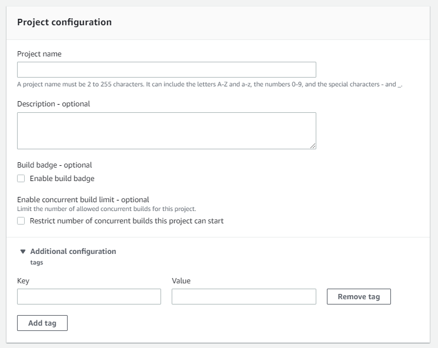

# Angular Frontend CI/CD

# Table of Content

- [Angular Frontend CI/CD](#angular-frontend-cicd)
- [Table of Content](#table-of-content)
- [Resources Used](#resources-used)
- [CI/CD Solution Architecture](#cicd-solution-architecture)
- [Steps](#steps)
    - [Repository](#repository)
        - [environment.prod.ts](#environmentprodts)
        - [gitignore](#gitignore)
    - [EC2 Instance](#ec2-instance)
        - [**************************Create an EC2 Instance**************************](#create-an-ec2-instance)
        - [Update Apt Repository](#update-apt-repository)
        - [Install Code-Deploy Agent](#install-code-deploy-agent)
        - [Install nginx](#install-nginx)
        - [Configure Code Deploy Service IAM role for EC2](#configure-code-deploy-service-iam-role-for-ec2)
        - [Tag EC2 Instance](#tag-ec2-instance)
    - [Code Build](#code-build)
        - [Project Configuration](#project-configuration)
        - [Source](#source)
        - [Primary source webhook events](#primary-source-webhook-events)
        - [Environment](#environment)
        - [Buildspec](#buildspec)
        - [Artifacts](#artifacts)
        - [Logs](#logs)
    - [Code Deploy](#code-deploy)
        - [Create Application](#create-application)
        - [Deployment groups](#deployment-groups)
        - [Deployment groups: Deployment group name](#deployment-groups-deployment-group-name)
        - [Deployment groups: Service role](#deployment-groups-service-role)
        - [Deployment groups: Deployment type](#deployment-groups-deployment-type)
        - [Deployment groups: Environment configuration](#deployment-groups-environment-configuration)
        - [Deployment groups: Agent Configuration with AWS Systems Manager](#deployment-groups-agent-configuration-with-aws-systems-manager)
        - [Deployment groups: Deployment Configuration](#deployment-groups-deployment-configuration)
        - [Deployment groups: Load Balancer](#deployment-groups-load-balancer)
        - [Deployment groups: Advanced - optional](#deployment-groups-advanced---optional)
    - [AWS CodePipeline](#aws-codepipeline)
        - [Pipeline settings](#pipeline-settings)
        - [Advanced Settings](#advanced-settings)
        - [Add Source Stage](#add-source-stage)
        - [Add build stage](#add-build-stage)
        - [Add deploy stage](#add-deploy-stage)
        - [Review](#review)
- [Conclusion](#conclusion)
- [Miscellaneous](#miscellaneous)
    - [Sample Repository](#sample-repository)
    - [Connection to GitHub Enterprise Server](#connection-to-github-enterprise-server)
        - [Select Provider](#select-provider)
        - [Connection Settings](#connection-settings)

<!-- /TOC -->
# Resources Used

1. EC2 Instance
2. AWS CodePipeline
3. AWS CodeDeploy
4. AWS CodeBuild
5. Enterprise GitHub
6. IAM Roles

# CI/CD Solution Architecture

We will be proceeding with the following architecture for the CI/CD for an Angular application.


# Steps

## Repository

Setup the repository to manage credentials for automatic deployment.

[Angular](https://angular.io/guide/build)

### environment.prod.ts

This is to be created to isolate production and local code development.

```tsx
export const environment = {
  production: true,
  APIUrl: "", // To be replaced by deployment instance
};
```

### .gitignore

This will include the typical angular project .gitignore.

[](https://github.com/angular/angular/blob/main/.gitignore)

```
.DS_STORE

/dist/
/bazel-out
/integration/bazel/bazel-*
*.log
/node_modules/

# CircleCI temporary file for cache key computation.
# See `save_month_to_file` in `.circleci/config.yml`.
month.txt

# Include when developing application packages.
pubspec.lock
.c9
.idea/
.devcontainer/*
!.devcontainer/README.md
!.devcontainer/recommended-devcontainer.json
!.devcontainer/recommended-Dockerfile
.settings/
.vscode/launch.json
.vscode/settings.json
.vscode/tasks.json
*.swo
*.swp
modules/.settings
modules/.vscode
.vimrc
.nvimrc

# Don't check in secret files
*secret.js

# Ignore npm/yarn debug log
npm-debug.log
yarn-error.log

# build-analytics
.build-analytics

# rollup-test output
/modules/rollup-test/dist/

# User specific bazel settings
.bazelrc.user

# User specific ng-dev settings
.ng-dev.user*

.notes.md
baseline.json

# Ignore .history for the xyz.local-history VSCode extension
.history

# Husky
.husky/_
aio/content/examples/.DS_Store
```

## EC2 Instance

### **************************Create an EC2 Instance**************************

Things to consider:

1. Operating System: Ubuntu-jammy-22.04 
2. Elastic IP address needs to be assigned

### Update Apt Repository

```bash
sudo apt update
sudo apt upgrade
```

### Install Code-Deploy Agent

[Install the CodeDeploy agent for Ubuntu Server - AWS CodeDeploy](https://docs.aws.amazon.com/codedeploy/latest/userguide/codedeploy-agent-operations-install-ubuntu.html)

```bash
sudo apt install ruby-full
sudo apt install wget
cd /home/ubuntu
wget https://bucket-name.s3.region-identifier.amazonaws.com/latest/install
chmod +x ./install
sudo ./install auto
sudo service codedeploy-agent start
sudo service codedeploy-agent status
```

### Install nginx

```bash
sudo apt install nginx
```

### Configure Code Deploy Service IAM role for EC2

Create a User policy and assign the following AWS managed policy to it. Then attach it to EC2. 

IAM: **AmazonEC2RoleforAWSCodeDeploy**

```json
{
    "Version": "2012-10-17",
    "Statement": [
        {
            "Action": [
                "s3:GetObject",
                "s3:GetObjectVersion",
                "s3:ListBucket"
            ],
            "Effect": "Allow",
            "Resource": "*"
        }
    ]
}
```

### Tag EC2 Instance

It is necessary for Code deploy application deployment group to recognize the instance.

Key: Name

Value: ****unique****-*****name-for-ec2*****

## Code Build

This step is necessary to generate the artifacts of `ng build` of the frontend application. Create a code Build Project from the Code Build in AWS Console.

### Project Configuration



Give a project name. Optionally Build Badge can be turned on.

### Source


Put GitHub Enterprise as the source provider. Configure the GitHub Enterprise personal access token from your enterprise GitHub Developer settings tab. Be sure to provide Repo Full access to the PAT and set the expiration likewise. Provide the 


Once the personal token is saved in the code build. Put the Repository URL.


### Primary source webhook events

This can be left unchecked. AWS Code Pipeline will take care of that.


### Environment

This is important consideration since it looks at the codebuild script: buildspec.yml in your source code. To ensure that your build environment will not fail refer to the codebuild environment Docker images for testing.

[Docker images provided by CodeBuild - AWS CodeBuild](https://docs.aws.amazon.com/codebuild/latest/userguide/build-env-ref-available.html)

The following could be an instance of one configuration.


To configure the role for AWS CodeBuild let the CodeBuild create one or refer to the following documentation for creating one. Easier option is to let CodeBuild take care of it.

[AWS CodeBuild permissions reference - AWS CodeBuild](https://docs.aws.amazon.com/codebuild/latest/userguide/auth-and-access-control-permissions-reference.html)

### Buildspec


Place the buildspec.yml configuration file into root of the project. The typical file will look like this for angular project.

```yaml
version: 0.2
phases:
    install:
      runtime-versions:
        nodejs: 18
    pre_build:
      commands:
          - echo Installing source NPM dependencies...
          - npm install --force
          - npm install -g @angular/cli
    build:
        commands:
            - echo Build started on `date`
            - ng build --configuration=production
    post_build:
         commands:
            - echo Build completed on `date`
artifacts:
    files:
        - 'dist/**/*'
        - appspec.yml
        - 'scripts/**'
        - nginx.conf
```

<aside>
💡 Note: nginx.conf has been included in the source repository to manage nginx configuration as a part of deployment. Additionally, scripts directory and appspec.yml are requirements for AWS CodeDeploy for the deployment configuration.

</aside>

For reference:

[Build specification reference for CodeBuild - AWS CodeBuild](https://docs.aws.amazon.com/codebuild/latest/userguide/build-spec-ref.html)

---

### Artifacts

This is where you usually define where to store the generated artifacts from build into. However, since this code build will be used in conjunction with AWS CodePipeline, it will be managed by CodePipeline. We can leave it to No artifacts right now.


### Logs

Additionally, Logging can be turned on to get information on CodeBuild. However, if you are sure that the script works or alternatively, we can verify it from the AWS CodePipeline console for Code Build errors. This can be left unchecked.


## Code Deploy

It manages the deployment of artifacts into the EC2 instance. Make sure to do code-deploy agent installation first in EC2 instance. From the AWS Code Deploy Console proceed with create application.

### Create Application

Give an application name and select a compute platform to deploy the code. For this case: EC2/On-premises.


### Deployment groups

Select the currently created application. and select the Deployment groups tab. Then proceed with the Create Deployment group.

### Deployment groups: Deployment group name


Give a unique deployment group name.

### Deployment groups: Service role


Create a service role for the AWS Code Deploy. For this create a role in AWS IAM console and Attach the following AWS managed Role:

AWSCodeDeployRole

The policy should be like this:

```json
{
    "Version": "2012-10-17",
    "Statement": [
        {
            "Effect": "Allow",
            "Action": [
                "autoscaling:CompleteLifecycleAction",
                "autoscaling:DeleteLifecycleHook",
                "autoscaling:DescribeAutoScalingGroups",
                "autoscaling:DescribeLifecycleHooks",
                "autoscaling:PutLifecycleHook",
                "autoscaling:RecordLifecycleActionHeartbeat",
                "autoscaling:CreateAutoScalingGroup",
                "autoscaling:CreateOrUpdateTags",
                "autoscaling:UpdateAutoScalingGroup",
                "autoscaling:EnableMetricsCollection",
                "autoscaling:DescribePolicies",
                "autoscaling:DescribeScheduledActions",
                "autoscaling:DescribeNotificationConfigurations",
                "autoscaling:SuspendProcesses",
                "autoscaling:ResumeProcesses",
                "autoscaling:AttachLoadBalancers",
                "autoscaling:AttachLoadBalancerTargetGroups",
                "autoscaling:PutScalingPolicy",
                "autoscaling:PutScheduledUpdateGroupAction",
                "autoscaling:PutNotificationConfiguration",
                "autoscaling:PutWarmPool",
                "autoscaling:DescribeScalingActivities",
                "autoscaling:DeleteAutoScalingGroup",
                "ec2:DescribeInstances",
                "ec2:DescribeInstanceStatus",
                "ec2:TerminateInstances",
                "tag:GetResources",
                "sns:Publish",
                "cloudwatch:DescribeAlarms",
                "cloudwatch:PutMetricAlarm",
                "elasticloadbalancing:DescribeLoadBalancers",
                "elasticloadbalancing:DescribeInstanceHealth",
                "elasticloadbalancing:RegisterInstancesWithLoadBalancer",
                "elasticloadbalancing:DeregisterInstancesFromLoadBalancer",
                "elasticloadbalancing:DescribeTargetGroups",
                "elasticloadbalancing:DescribeTargetHealth",
                "elasticloadbalancing:RegisterTargets",
                "elasticloadbalancing:DeregisterTargets"
            ],
            "Resource": "*"
        }
    ]
}
```

### Deployment groups: Deployment type

According to your preference select the deployment strategy. Usually this depends on the requirement of application.


### Deployment groups: Environment configuration

This depends on the solution architecture if you have multiple instance configuration for redundancy purpose. For a single instance deployment select ********************Amazon EC2 instance******************** and select the appropriate tag you created while setting up your instance.


### Deployment groups: Agent Configuration with AWS Systems Manager

AWS Systems Manager is wonderful tool in managing SysOps work. It can be used to automate installation of code deploy agent in the EC2 instance also. However, for ease of setup, we have manually installed the code deploy agent for more control vectors. So you can proceed with the following option. 


### Deployment groups: Deployment Configuration

We can opt with the one shown below. However, this can be tweaked with your own project requirements usually in the case of Auto Scaling Groups. 


### Deployment groups: Load Balancer

If you have implemented the load balancer in your solution, select an appropriate target group. However, in case of single instance uncheck the Enable load balancing option.


### Deployment groups: Advanced - optional

Additional settings can be configured to enhance the deployment. Following are additional features that can be enabled with Deployment groups. You can then proceed with Create deployment group option.


## AWS CodePipeline

AWS CodePipeline helps us to create end to end CI/CD and DevOps cycle for the project. It can integrate the following phases of DevOps Cycle:


Proceed with the Create Pipeline option from the AWS CodePipeline Console.

### Pipeline settings

Give pipeline a unique name. You can let pipeline create a service role for your project which is an easier option. For reference the following is the Service Role for the AWS CodePipeline.

```json
{
    "Statement": [
        {
            "Action": [
                "iam:PassRole"
            ],
            "Resource": "*",
            "Effect": "Allow",
            "Condition": {
                "StringEqualsIfExists": {
                    "iam:PassedToService": [
                        "cloudformation.amazonaws.com",
                        "elasticbeanstalk.amazonaws.com",
                        "ec2.amazonaws.com",
                        "ecs-tasks.amazonaws.com"
                    ]
                }
            }
        },
        {
            "Action": [
                "codecommit:CancelUploadArchive",
                "codecommit:GetBranch",
                "codecommit:GetCommit",
                "codecommit:GetRepository",
                "codecommit:GetUploadArchiveStatus",
                "codecommit:UploadArchive"
            ],
            "Resource": "*",
            "Effect": "Allow"
        },
        {
            "Action": [
                "codedeploy:CreateDeployment",
                "codedeploy:GetApplication",
                "codedeploy:GetApplicationRevision",
                "codedeploy:GetDeployment",
                "codedeploy:GetDeploymentConfig",
                "codedeploy:RegisterApplicationRevision"
            ],
            "Resource": "*",
            "Effect": "Allow"
        },
        {
            "Action": [
                "codestar-connections:UseConnection"
            ],
            "Resource": "*",
            "Effect": "Allow"
        },
        {
            "Action": [
                "elasticbeanstalk:*",
                "ec2:*",
                "elasticloadbalancing:*",
                "autoscaling:*",
                "cloudwatch:*",
                "s3:*",
                "sns:*",
                "cloudformation:*",
                "rds:*",
                "sqs:*",
                "ecs:*"
            ],
            "Resource": "*",
            "Effect": "Allow"
        },
        {
            "Action": [
                "lambda:InvokeFunction",
                "lambda:ListFunctions"
            ],
            "Resource": "*",
            "Effect": "Allow"
        },
        {
            "Action": [
                "opsworks:CreateDeployment",
                "opsworks:DescribeApps",
                "opsworks:DescribeCommands",
                "opsworks:DescribeDeployments",
                "opsworks:DescribeInstances",
                "opsworks:DescribeStacks",
                "opsworks:UpdateApp",
                "opsworks:UpdateStack"
            ],
            "Resource": "*",
            "Effect": "Allow"
        },
        {
            "Action": [
                "cloudformation:CreateStack",
                "cloudformation:DeleteStack",
                "cloudformation:DescribeStacks",
                "cloudformation:UpdateStack",
                "cloudformation:CreateChangeSet",
                "cloudformation:DeleteChangeSet",
                "cloudformation:DescribeChangeSet",
                "cloudformation:ExecuteChangeSet",
                "cloudformation:SetStackPolicy",
                "cloudformation:ValidateTemplate"
            ],
            "Resource": "*",
            "Effect": "Allow"
        },
        {
            "Action": [
                "codebuild:BatchGetBuilds",
                "codebuild:StartBuild",
                "codebuild:BatchGetBuildBatches",
                "codebuild:StartBuildBatch"
            ],
            "Resource": "*",
            "Effect": "Allow"
        },
        {
            "Effect": "Allow",
            "Action": [
                "devicefarm:ListProjects",
                "devicefarm:ListDevicePools",
                "devicefarm:GetRun",
                "devicefarm:GetUpload",
                "devicefarm:CreateUpload",
                "devicefarm:ScheduleRun"
            ],
            "Resource": "*"
        },
        {
            "Effect": "Allow",
            "Action": [
                "servicecatalog:ListProvisioningArtifacts",
                "servicecatalog:CreateProvisioningArtifact",
                "servicecatalog:DescribeProvisioningArtifact",
                "servicecatalog:DeleteProvisioningArtifact",
                "servicecatalog:UpdateProduct"
            ],
            "Resource": "*"
        },
        {
            "Effect": "Allow",
            "Action": [
                "cloudformation:ValidateTemplate"
            ],
            "Resource": "*"
        },
        {
            "Effect": "Allow",
            "Action": [
                "ecr:DescribeImages"
            ],
            "Resource": "*"
        },
        {
            "Effect": "Allow",
            "Action": [
                "states:DescribeExecution",
                "states:DescribeStateMachine",
                "states:StartExecution"
            ],
            "Resource": "*"
        },
        {
            "Effect": "Allow",
            "Action": [
                "appconfig:StartDeployment",
                "appconfig:StopDeployment",
                "appconfig:GetDeployment"
            ],
            "Resource": "*"
        }
    ],
    "Version": "2012-10-17"
}
```


### Advanced Settings

This is where the Artifact store can be defined and encryption method for it. You can proceed with the following options for ease of access:


### Add Source Stage

Select the source provider. For instance, if you have your repository hosted in Enterprise GitHub Server, there is additional setting to setup connection to GitHub Enterprise Server which can be found in Miscellaneous section of this documentation.  Select the connection, the repository name and the branch name and proceed with rest of the settings as follows:


### Add build stage

Select the AWS CodeBuild as the Build provider and the project that you created in the earlier section.  The Environment variables lets you pass secrets to variables in buildspec.yml. Refer to the documentation for the use case and proceed with rest of configuration.


### Add deploy stage

Proceed with the configuration for the Deploy with the appropriate configuration that you created earlier.


### Review

Proceed to the Review stage and select option Create pipeline.

# Conclusion

Hence the CI/CD pipeline has successfully been setup. You will see the complete pipeline in AWS CodePipeline and be able to see progression through different stages as shown in the following. Further modification can be done to achieve greater setup for CI/CD with AWS.

# Miscellaneous

## Sample Repository

This repository contains sample Angular Application created from official tutorial of Angular Documentation. 

[Angular Tour of Heroes Tutorial Link](https://angular.io/tutorial/tour-of-heroes)

This repository can be used as reference to find relevant structure for project, best practices and documentation purposes.

## Connection to GitHub Enterprise Server

There are few steps to perform before connecting to GitHub Enterprise Server. From the Developer Tools, select Connections option and proceed with Create connection.


### Select Provider

Select GitHub Enterprise Server.


### Connection Settings

Name your connection and provide with URL and select option Connect to GitHub Enterprise Server. This will prompt you to login to Github Enterprise Server using your corporate credentials for GitHub Enterprise. If you are Organization owner where the repository belongs to you can proceed ahead. However, if you are not, you can request the Organization owner for the access to the selected repositories. This Connection is established as GitHub Apps. Once approved your connection is good to go.


After approval you can check the connection status in the Connections console as follows:


---
